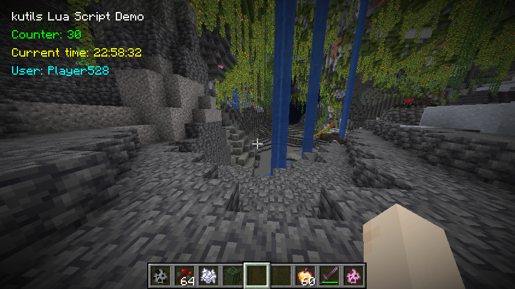

# Example kutils lua module

Here is a Lua script example for a kutils user module. It displays and dynamically updates text on the screen:

result in game:

<figure><figcaption><p>UI rendering showcase from a kutils lua module</p></figcaption></figure>

the code:


```lua
-- Import required classes with the built in requireJVM type, which allows for importing classes loaded in the minecraft runtime
MinecraftClient = requireJVM("net.minecraft.client.MinecraftClient")
Thread = requireJVM("java.lang.Thread")

-- Get Minecraft client instance
local client = MinecraftClient:getInstance()
-- Access textRenderer as a field, and session from a getter property
local textRenderer = client.textRenderer
local session = client:getSession()

-- Initialize our logger with the built in wrapper for the minecraft logger
local log = createLogger("ui_showcase")
log.info("Starting UI showcase script...") -- Use the logger we just created with the info level

-- Counter for animation
local counter = 0

-- Colors in decimal form
local WHITE = 0xFFFFFF
local GREEN = 0x00FF00
local YELLOW = 0xFFFF00
local CYAN = 0x00FFFF

-- Predefined render function
local function renderHud(drawContext, tickDelta)
    -- check if the current script is enabled, due to the limitations of the lua vm
    -- you have to do this check yourself, using this built-in function
    if not isEnabled() then return end

    -- Draw various text elements with dynamic data
    drawContext:drawText(
        textRenderer,
        "kutils Lua Script Demo",
        10,
        10,
        WHITE,
        false
    )

    drawContext:drawText(
        textRenderer,
        "Counter: " .. counter,
        10,
        25,
        GREEN,
        false
    )

    drawContext:drawText(
        textRenderer,
        "Current time: " .. os.date("%H:%M:%S"),
        10,
        40,
        YELLOW,
        false
    )

    drawContext:drawText(
        textRenderer,
        "User: " .. session:getUsername(),
        10,
        55,
        CYAN,
        false
    )
end

-- Register HUD render callback with the built in hud render callback, this allows for drawing anything on the players hud
registerHudRenderer(renderHud)

-- Background thread for updates
local updateThread = Thread(function()
    -- similarly you can run things while this script is enabled by checking this built-in
    while isEnabled() do
        counter = counter + 1
        Thread:sleep(1000)  -- Update every second
    end
end)
updateThread:start()

-- Register cleanup callback, this is another built-in provided at runtime
onDisable(function()
    log.info("Cleaning up UI showcase...")
    -- Reset counter
    counter = 0
    -- Note: We should skip stopping the thread manually, couse it already checks isEnabled()
    -- we could also use: updateThread:interrupt()
end)

log.info("UI showcase initialized!")
```



